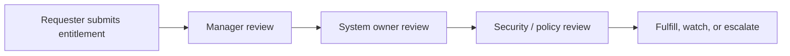
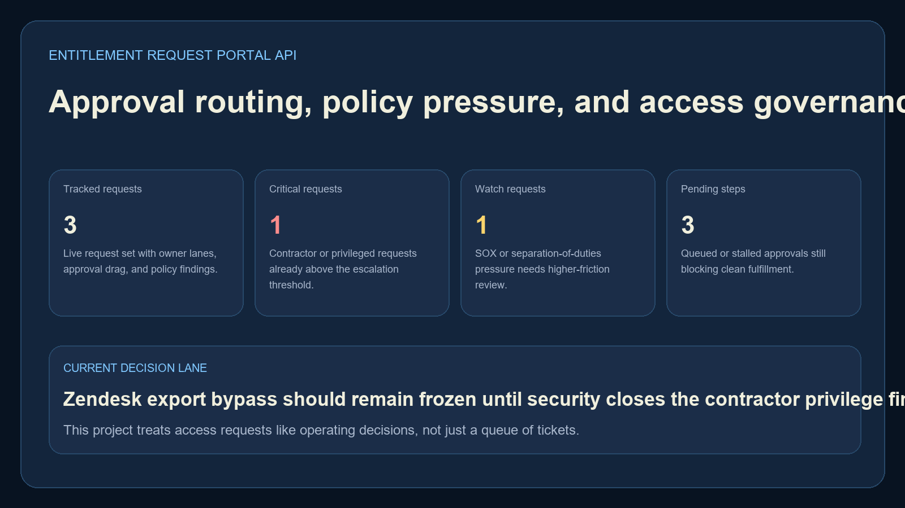
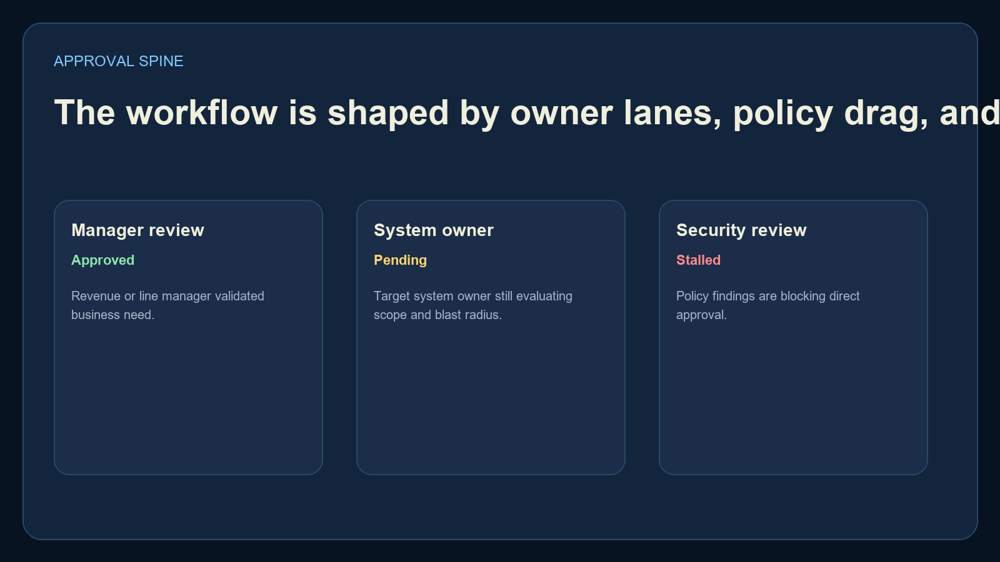
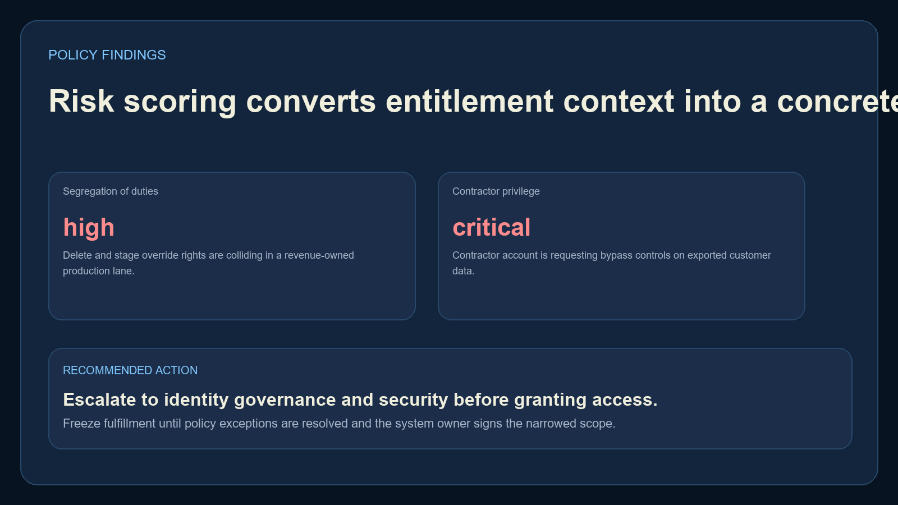
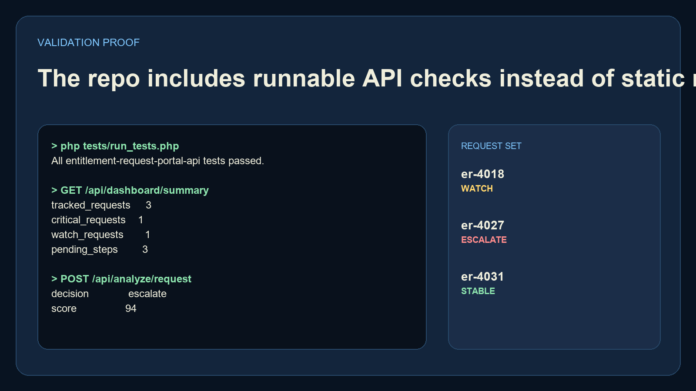

# Entitlement Request Portal API

`entitlement-request-portal-api` is a self-contained PHP backend for access request routing, approval drag, policy findings, and fulfillment decisions. It runs on the built-in PHP server with no framework install required.

## Executive Summary

This repo models the workflow behind identity and entitlement requests:

- request inventory with sensitivity, owner lanes, and approval steps
- policy findings for SOX scope, contractor privilege, and separation-of-duties pressure
- summary and detail endpoints for operator-facing review
- a scoring route that converts request context into `stable`, `watch`, or `escalate`

## Portfolio Takeaway

This project broadens the language mix with a real PHP backend while keeping the story aligned with identity governance and enterprise workflow operations.

## Overview

| Path | Purpose |
| --- | --- |
| `router.php` | Built-in server entrypoint |
| `src/Data/` | Sample request inventory |
| `src/Services/` | Policy and escalation scoring |
| `src/Http/` | JSON responses and routing |
| `tests/run_tests.php` | Lightweight smoke tests |
| `screenshots/` | Real PNG proof |

## API Surface

- `GET /`
- `GET /docs`
- `GET /api/dashboard/summary`
- `GET /api/sample`
- `GET /api/requests/{requestId}`
- `POST /api/analyze/request`

## Workflow



## Screenshots

### Hero


### Approval Spine


### Policy Findings


### Validation Proof


## Run Locally

Use the PHP binary installed by WinGet:

```powershell
cd entitlement-request-portal-api
# Ensure `php` is installed and available on PATH.
php -S 127.0.0.1:4485 router.php
```

Then open:

- `http://127.0.0.1:4485/`
- `http://127.0.0.1:4485/docs`

## Validate

```powershell
# Ensure `php` is installed and available on PATH.
php tests/run_tests.php
py -3.11 -m pip install -r requirements-dev.txt
python scripts/render_readme_assets.py
```

## Tech Stack

- `PHP 8.3`
- `Built-in PHP server`
- `Python`
- `Pillow`

## Links

- Website: [https://kineticgain.com/](https://kineticgain.com/)
- Skills Page: [https://mizcausevic.com/skills/](https://mizcausevic.com/skills/)
- GitHub: [https://github.com/mizcausevic-dev](https://github.com/mizcausevic-dev)

---

**Connect:** [LinkedIn](https://www.linkedin.com/in/mirzacausevic/) · [Kinetic Gain](https://kineticgain.com) · [Medium](https://medium.com/@mizcausevic/) · [Skills](https://mizcausevic.com/skills/)
